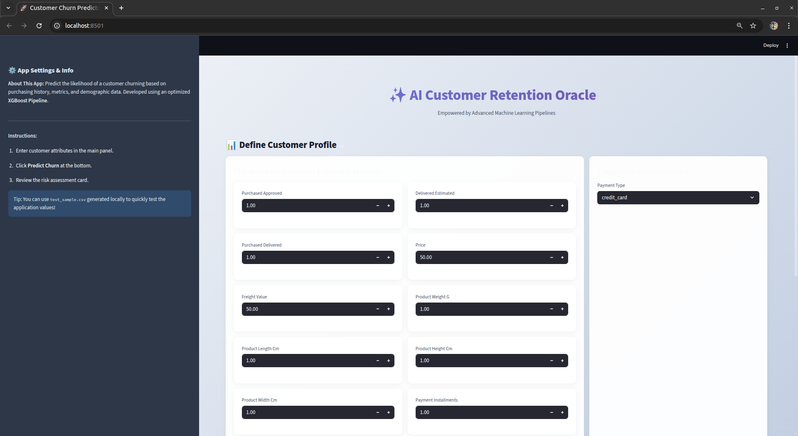
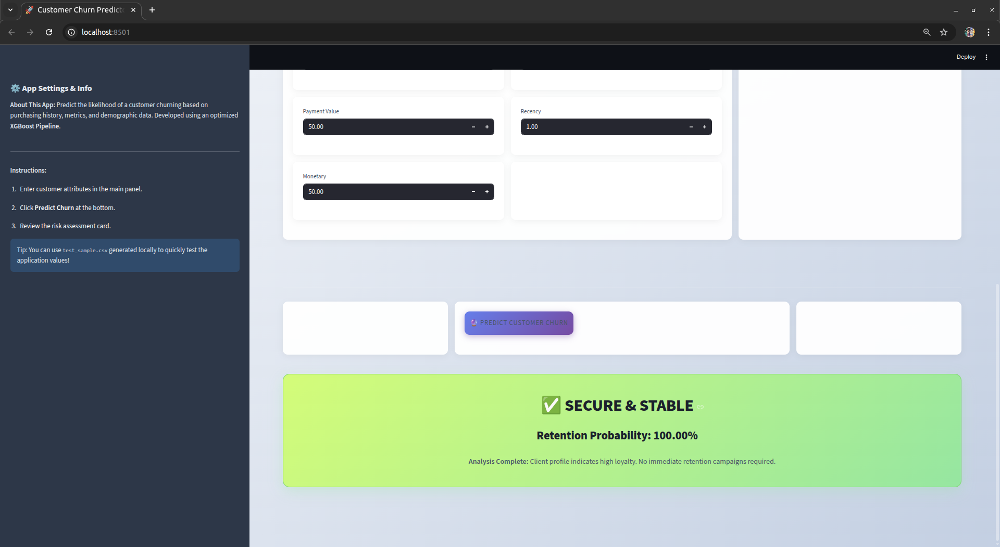

# 🇧🇷 Brazilian E-Commerce Analytics & ML Suite (Olist Dataset)

An end-to-end Data Analytics & Machine Learning project built on the Brazilian E-Commerce Public Dataset by Olist.  

---

## 🗂 Database Schema

Below is the relational schema of the Olist dataset:

The dataset includes interconnected tables:
- Customers
- Orders
- Order Items
- Payments
- Reviews
- Products
- Sellers
- Geolocation

---

# 📌 Project Overview

This project extracts actionable business insights and builds predictive ML systems for:

- 🎯 Customer Churn Prediction
- 💰 Payment Value Prediction
- 🧠 Review Sentiment Analysis
- 📈 Sales Forecasting
- 👥 Customer Segmentation

---

# 🌐 Streamlit Application UI

## 🖥️ Main Prediction Interface

Users can:
- Input customer/order details
- Predict churn probability
- Predict payment value
- Perform sentiment classification

---

## 📊 Forecasting & Analytics Dashboard

Includes:
- Sales forecasting visualization
- Sentiment distribution
- Interactive charts
- Business insight summaries

---

# 🔎 1. Exploratory Data Analysis (EDA)

- Missing value treatment  
- Outlier detection  
- Revenue trend analysis  
- Regional sales comparison  
- Correlation heatmaps  
- Category performance analysis  

---

# 📊 2. Statistical Hypothesis Testing

### ✔ ANOVA
- Revenue comparison across product categories  
- Regional sales significance testing  

### ✔ Chi-Square
- Payment type vs churn  
- Review score vs churn  
- Delivery delay vs satisfaction  

---

# 🤖 3. Machine Learning Models

## 🎯 Classification – Customer Churn

Models:
- Logistic Regression  
- Decision Tree  
- Random Forest  
- KNN  

Evaluation:
- Accuracy  
- Precision  
- Recall  
- F1 Score  
- ROC-AUC  
- Confusion Matrix  

---

## 💰 Regression – Payment Prediction

Models:
- Linear Regression  
- Ridge / Lasso  
- Random Forest Regressor  

Evaluation:
- MAE  
- RMSE  
- R²  

---

# 👥 4. Clustering

- KMeans  
- DBSCAN  
- Silhouette Score  
- Cluster visualization  
- Business interpretation  

---

# 🧠 5. NLP – Sentiment Analysis

Preprocessing:
- Lowercasing  
- Stopword removal  
- Tokenization  

Vectorization:
- TF-IDF  
- Word2Vec (optional)  

Outputs:
- Sentiment distribution chart  
- Top keywords  
- Extracted entities  

---

# 📈 6. Time Series Forecasting

Models:
- ARIMA  
- SARIMA  
- Prophet  

Process:
- Stationarity check (ADF)  
- Differencing  
- 6–12 month forecasting  
- Model comparison  

Evaluation:
- MAE  
- RMSE  

---

# ⚙ End-to-End ML Pipeline

- Data preprocessing  
- Feature engineering  
- Train/Test split  
- Cross-validation  
- Model comparison  
- Final model selection  

Built using scikit-learn Pipelines.

---
